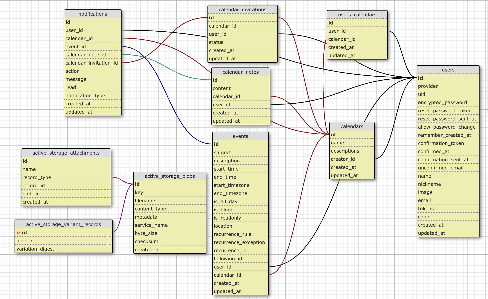

# Group Scheduler API

A Rails API backend for a group calendar scheduling application that allows users to manage calendars, events, and collaborate with team members.

## System Requirements

* Ruby version: 3.2.2
* Rails version: 7.1.2
* PostgreSQL 15
* Redis (for Action Cable)
* Docker

## Key Features

- User authentication with Devise Token Auth
- Google OAuth2 integration
- Calendar management
- Event scheduling with recurring events support
- Real-time notifications using Action Cable
- Calendar sharing and invitations
- Note sharing within calendars
- File attachments using Active Storage with Cloudinary/AWS S3
- RESTful JSON API
- Dockerized development environment

## Setup

1. Clone the repository
```bash
git clone [repository-url]
cd group-scheduler-api
```

2. Environment variables
Create a `.env` file in the root directory with the following variables:
```
CLOUDINARY_URL=
GOOGLE_CLIENT_ID=
GOOGLE_CLIENT_SECRET=
FRONT_END_URL=
REDIS_URL=
DATABASE_URL=
```

3. Docker Setup:

```bash
docker compose build
```

4. Install dependencies
```bash
docker compose run web bundle install
```

5. Set up the database
```bash
docker compose run web bundle exec rails db:create
docker compose run web bundle exec rails db:migrate
docker compose run web bundle exec rails db:seed
```

6. Start the server
```bash
docker compose up
```


## API Endpoints

### Authentication
- `POST /api/v1/auth/sign_up` - User registration
- `POST /api/v1/auth/sign_in` - User login
- `DELETE /api/v1/auth/sign_out` - User logout

### Users
- `GET /api/v1/users` - List all users
- `GET /api/v1/users/:id` - Get user details
- `PUT /api/v1/users/:id` - Update user
- `GET /api/v1/users/notifications` - Get user notifications

### Calendars
- CRUD operations for calendars
- Calendar sharing functionality
- Calendar invitation system

### Events
- CRUD operations for events
- Recurring event support
- Event filtering by date range

### Calendar Notes
- CRUD operations for calendar notes
- Real-time note updates

## Deployment

The application is configured for deployment on Fly.io:
```bash
fly deploy
```
Configuration details can be found in `fly.toml`


## Dependencies

Key gems used:
- `devise` & `devise_token_auth` - Authentication
- `omniauth-google-oauth2` - Google OAuth2 integration
- `cloudinary` - Cloud image storage
- `redis` - Action Cable backend
- `rack-cors` - CORS handling
- `aws-sdk-s3` - AWS S3 storage integration

## Database Schema

The application uses PostgreSQL with the following main models:
- Users
- Calendars
- Events
- Calendar Notes
- Calendar Invitations
- Notifications




## Database Schema & Model Relationships

### Core Models

#### Users
- Central model for user authentication and profile management
- Attributes: email, name, nickname, color, authentication tokens
- Relationships:
  - Has many calendars (through calendars_users)
  - Has many events
  - Has many calendar_notes
  - Has many calendar_invitations
  - Has many notifications
  - Can be a creator of multiple calendars (creator_id)

#### Calendars
- Represents a shared calendar space
- Attributes: name, description, creator_id
- Relationships:
  - Belongs to a creator (User)
  - Has many users (through calendars_users)
  - Has many events
  - Has many calendar_notes
  - Has many calendar_invitations
  - Has many notifications

#### Events
- Represents calendar events/appointments
- Attributes: subject, description, start_time, end_time, location, recurrence settings
- Relationships:
  - Belongs to a calendar
  - Belongs to a user (creator)
  - Has many notifications

### Joining Tables & Supporting Models

#### calendars_users (Join Table)
- Manages many-to-many relationship between users and calendars
- Columns:
  - user_id (foreign key)
  - calendar_id (foreign key)
- Enables users to be members of multiple calendars and calendars to have multiple users

#### Calendar Invitations
- Manages calendar sharing/invitation system
- Attributes: status (pending/accepted/rejected)
- Relationships:
  - Belongs to a calendar
  - Belongs to a user
  - Has many notifications

#### Calendar Notes
- Enables collaboration through shared notes within calendars
- Attributes: content
- Relationships:
  - Belongs to a calendar
  - Belongs to a user (creator)
  - Has many notifications

#### Notifications
- Handles system-wide notifications for various actions
- Attributes: action, message, read status, notification_type
- Relationships:
  - Belongs to a user (recipient)
  - Belongs to a calendar
  - Optional belongs_to relationships:
    - event
    - calendar_note
    - calendar_invitation

### Active Storage Tables
- `active_storage_blobs`: Stores file metadata
- `active_storage_attachments`: Manages polymorphic relationships for attachments
- `active_storage_variant_records`: Handles image variants

This schema design enables:
- Multi-user calendar collaboration
- Event management with recurring events
- Calendar sharing with invitation system
- Real-time notifications
- Note sharing within calendars
- File attachments support

## Real-time Features

The application uses Action Cable for real-time notifications:
- Event updates
- Calendar note changes
- Calendar invitations
- User notifications